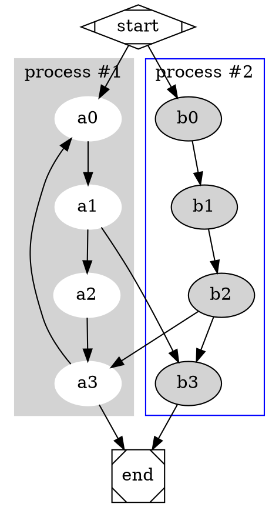

# markdown-it-graphviz-exec

Render GraphViz dot language to svg using executables.

Depends on [GraphViz](https://graphviz.org/)




Add attributes to the output element with JSON argument

```graphviz
{ "attrs": { "width": "100%", "style": "border: 2px dashed blue" } }
digraph G {Hello->World}
```

```graphviz
{ "cmd": "neato" }
digraph sequenceDiagramExample {
  node [ shape="record" ]
  clientHead [ label="Client" pos="0,1.5!" ];
  clientPoint0 [ pos="0,0.75!" shape="point" width="0" ];
  clientFoot [ label="Client" pos="0,0!" ];
  htmlHead [ label="HTML" pos="1,1.5!" ];
  htmlPoint0 [ pos="1,0.75!" shape="point" width="0" ];
  htmlFoot [ label="HTML" pos="1,0!" ];
  clientHead -> clientPoint0 -> clientFoot [ dir="none" style="dashed" ]
  htmlHead -> htmlPoint0 -> htmlFoot [ dir="none" style="dashed" ]
  clientPoint0 -> htmlPoint0 [ label="get" labelloc="c" style="solid" ]
}
```


## Install

```
yarn add markdown-it-graphviz-exc
```

on macOS:

```
brew install graphviz
```

on Fedora:

```
dnf install graphviz
```

on Debian:

```
apt install graphviz
```
